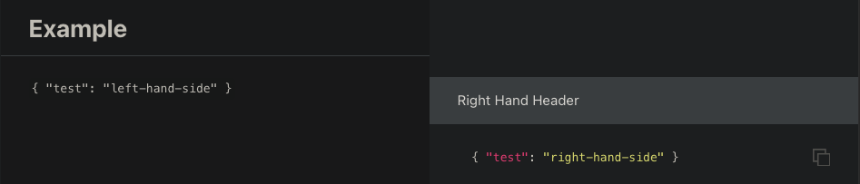
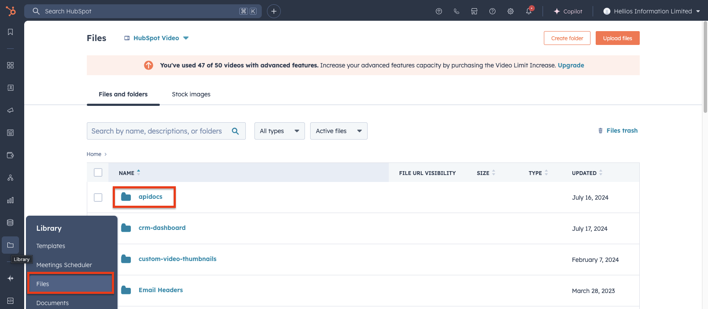

# Helios Api Documentation

These docs are generated using [slate](https://github.com/slatedocs/slate). Slates wiki
can be found [here](https://github.com/slatedocs/slate/wiki#getting-started) for more information about slate directly.

## Editing 
These pages are built using a mix of html and [markdown](https://www.markdownguide.org/cheat-sheet/) and are generated by ruby.

The main `index.html.md.erb` file contains general info such as meta tags, search functionality and which partials
to add to page.

In any partial any H1 headers are added at the top level of the table of contents, any H2s are added underneath the parent.

New partials can be added in other partials, like below:
```
<%= partial "includes/schemas/HScore.md.erb" %>
```

Code examples can be added to the right hand pane by using a markdown blockquote and markdown multiline code. These
will automatically be added to the right. To use code blocks on the left hand pane, you must use html code blocks
`````
# Example

// Right hand header
> Right Hand Header

// Right hand code example
```json
  { "test": "right-hand-side" }
```

// Code block 
<code>{ "test": "left-hand-side" }</code>
`````



## Running Locally

As said by the slate docs, it is easiest to run this via [Docker](https://docs.docker.com/get-started/get-docker/),
to avoid setting up complicated ruby environments and dependencies.

To run locally run
```sh
docker run --rm --name slate -p 4567:4567 -v $(pwd)/source:/srv/slate/source slatedocs/slate serve
```

This will expose the app on `localhost:4567`.
This does not have hot-reload so you will need to re-run this every time you want to view your new changes.

## Deploying

Once happy with your changes you can run
```sh
docker run --rm --name slate -v $(pwd)/build:/srv/slate/build -v $(pwd)/source:/srv/slate/source slatedocs/slate build
```

This will generate the static html and all required assets in `./build`.

To put this live on HubSpot navigate to the files page, on the left hand side, go to `apidocs` and replace the contents
of `apidocs` with the contents of `./build`.



You can then view the live page at [https://hellios.com/hubfs/apidocs/index.html](https://hellios.com/hubfs/apidocs/index.html).
